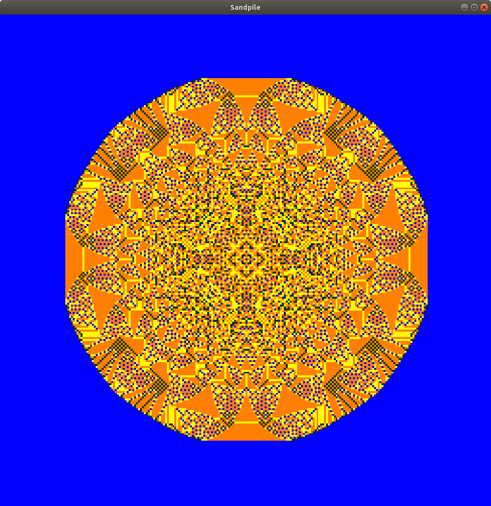

# C++/ OpenGL Abelian Sandpile visualiser

Produces a live visulation of the [Abelian Sandpile fractal](https://en.wikipedia.org/wiki/Abelian_sandpile_model).

All computation is completed on the GPU via OpenGL 4.3 compute shaders. The default sandpile of 216 grains require 65,000 iterations to resolve and takes 8 seconds to complete on an AMD RX Vega running Ubuntu's free drivers.

## Screenshots

Shows the completed render of the Abelian Sandpile.

The colors indicate:
- Light blue: Empty tile
- Dark blue: 1 high stack
- Yellow: 2 high stack
- Orange: 3 high stack
- Red: 4 or higher stack --> Only applicable when sandpile is still collapsing

## Dependencies

Building from source requires:
- GLUT
- GLEW
- GLFW3

Build using `make`. Depending on your distro, remove the `UBUNTU_FLAGS` constant or change `-lglfw` to `-lglfw3`.